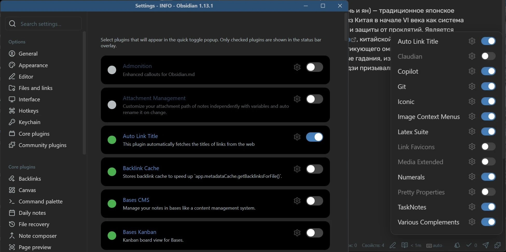

# Plugin Toggle

Quickly enable and disable Obsidian plugins from the status bar.

## Features

- Puzzle icon in the status bar
- Floating popup with toggles for each managed plugin
- Settings tab to choose which plugins appear in the popup
- Optional keyboard shortcut (assignable in **Settings → Hotkeys**)

## Usage

1. Open **Settings → Plugin Toggle**.
2. Enable the plugins you want to manage.
3. Select the puzzle icon in the status bar to open the popup.

Select the toggle next to a plugin to enable or disable it.

## Keyboard shortcut

1. Open **Settings → Hotkeys**.
2. Search for **Open overlay**.
3. Assign your preferred shortcut, for example `Ctrl+Shift+T`.

## Installation

1. Download `main.js`, `manifest.json`, and `styles.css` from the [latest release](https://github.com/hmnijp/obsidian-plugin-toggle/releases).
2. Copy them to `VaultFolder/.obsidian/plugins/obsidian-plugin-toggle/`.
3. Enable the plugin in **Settings → Community plugins**.

### BRAT

If you have the [BRAT](https://obsidian.md/plugins?id=obsidian42-brat) plugin installed, add `https://github.com/hmnijp/obsidian-plugin-toggle` to the list of beta plugins.

---

Created by [hmnijp](https://github.com/hmnijp/).
